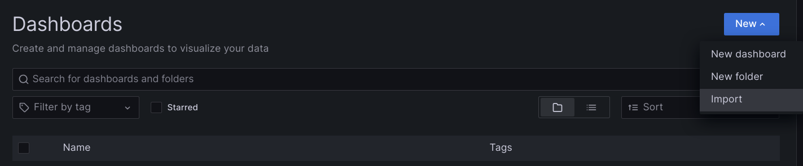
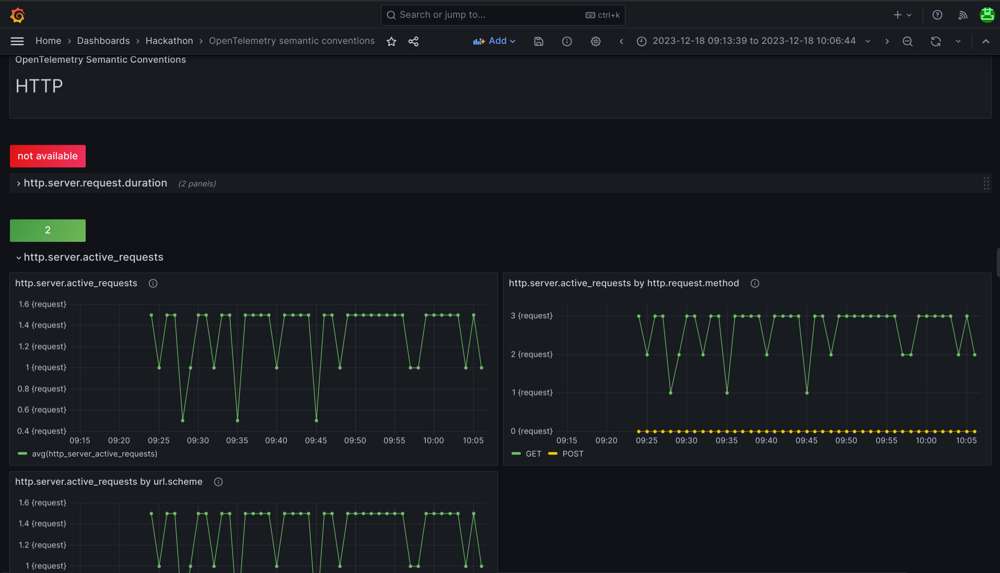

# OpenTelemetry Grafana Dashboard Catalog

This project dynamically creates a dashboard containing panels for all metrics
defined in the OpenTelemetry semantic conventions. This can help you to
determine which standardized OpenTelemetry metrics are emitted from your
application, futhermore you can copy panels from the catalog and customize them
for your own use.

## Requirements

* Python 3
* Git
* OpenTelemetry metrics available in Grafana in a Prometheus data source

## Usage

1. In the root directory of this repository, run the following command, piping
   the output to a filename which will contain the JSON dashboard definition:

```sh
python3 main.py > dashboard-catalog.json
```

2. In Grafana, navigate to the "Dashboards" section, then select "New" and "Import":

   

3. In the "Import dashboard" window, select "Upload dashboard JSON file" and
   select the file created in Step 1. As input, select a Prometheus data source
   that contains OpenTelemetry metrics. Then click "Import".

4. The imported dashboard then shows distinct sections for the semantic
   convention areas, with panels for all the metrics defined by OpenTelemetry
   semantic conventions. Data will show up for metrics that are available in the
   selected data source.

   
